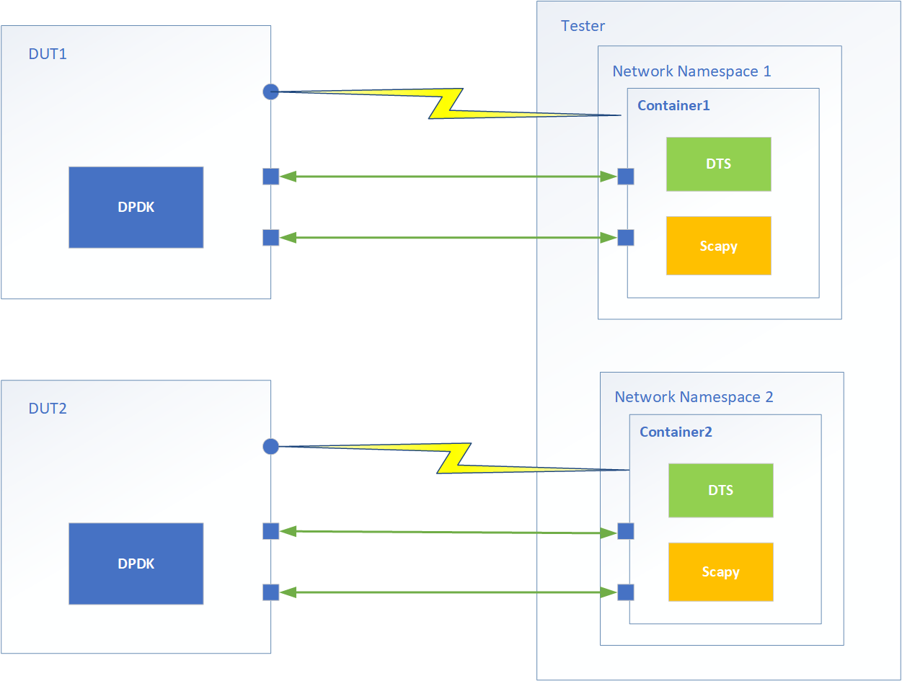
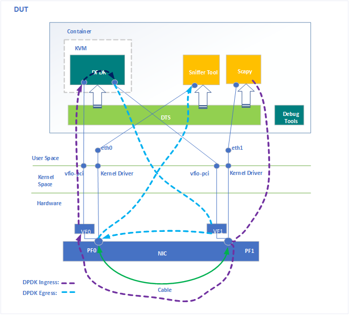

Practice with Container
=======================

This chapter describes practices to deploy DTS in containers mainly focusing on functional tests.
Scapy will be used as the traffic generator installed in the container with DTS. 

Topology
-------------
Like the illustration in :doc:`Introduction <./intro>`, DPDK can be deployed on a DUT for full functional
tests, and the tester can host multiple container instances to run tests parallelly with their respective
NICs which connected with different DUTs.

   DPDK on DUT

DTS in container also supports a single node deployment which installs DPDK, DTS and scapy in a same container,
and run tests to verify DPDK VF functions based on kernel PF drivers with two back-to-back connected ports of a NIC
on a DUT.

   Single Node

Container Image Preparation
---------------------------

Create Dockerfile
~~~~~~~~~~~~~~~~~~~~~~~~~~~~

Base Image
^^^^^^^^^^
The container image was built by a Dockerfile with the base image Ubuntu 20.04 from https://hub.docker.com/.
It can install the Python3 from its repository to support the scapy declared in requirements.txt.
The supported python version of each scapy release can be found on the page `the scapy installation guide <https://scapy.readthedocs.io/en/latest/installation.html>`_.::

    # syntax = docker/dockerfile:1
    FROM ubuntu:20.04

If any tool is needed, the tool docker image can be used as the base image. For example, if Intel VTune
will be used to debug DPDK issues, the DTS container image can be built base on `the Intel VTune docker image <https://hub.docker.com/r/intel/oneapi/tags>`_.::

    # syntax = docker/dockerfile:1
    FROM intel/oneapi-vtune:2022.3.1-devel-ubuntu20.04 

Tools and Packages
^^^^^^^^^^^^^^^^^^
Install required tools for DTS and scapy::

    ENV DEBIAN_FRONTEND=noninteractive
    RUN apt-get update && apt-get install -y apt-utils wget uuid-runtime iproute2 \
        wamerican-small vim ssh libpcap-dev python3 python3-pip net-tools \
        ethtool tcpdump pciutils git psmisc lsof lldpad linuxptp

If using single node deployment, the packages and tools to compile DPDK and run DPDK VF tests are needed.::

    RUN apt-get install -y python3-pyelftools meson ninja-build gcc libnuma-dev \
        libibverbs-dev cmake pkg-config netcat kmod qemu-system-x86

DTS Source Code
^^^^^^^^^^^^^^^
Download DTS::

    WORKDIR /opt/src
    RUN git clone http://dpdk.org/git/tools/dts
    RUN chmod +x /opt/src/dts/dep/QMP/qemu-ga-client

Python Modules
^^^^^^^^^^^^^^
Install required Pyhthon modules for DTS::

    RUN pip3 install --no-cache-dir --upgrade pip
    RUN pip3 install --no-cache-dir --upgrade -r /opt/src/dts/requirements.txt \
            setuptools wheel cryptography pycryptodome pycryptodomex gitpython \
            jinja2 ipython ptyprocess texttable
    RUN ln -s /usr/bin/python3 /usr/bin/python

SSH Server
^^^^^^^^^^
DTS communicates with Tester and DUT via SSH connections. The container will be working as a Tester with scapy installed,
and will be a DUT in the single node deployment. So the SSH server should be configured on the container image::

    RUN mkdir /var/run/sshd
    RUN echo 'root:password' | chpasswd
    RUN sed -i 's/#*PermitRootLogin prohibit-password/PermitRootLogin yes/g' /etc/ssh/sshd_config
    RUN sed -i 's@session\s*required\s*pam_loginuid.so@session optional pam_loginuid.so@g' /etc/pam.d/sshd
    ENV NOTVISIBLE "in users profile"
    RUN echo "export VISIBLE=now" >> /etc/profile
    EXPOSE 22

Environment Variable
^^^^^^^^^^^^^^^^^^^^
Add an environment variable IN_CONTAINER to indicate the DTS is running in a container::

    RUN echo "IN_CONTAINER=YES" >> /etc/environment

Build Image
~~~~~~~~~~~
Build the image with the created Dockerfile::

    docker build --progress=plain -t dts:v0.1 . --no-cache

Run DTS
--------
Start Container
~~~~~~~~~~~~~~~
DPDK on DUT
^^^^^^^^^^^
Start the container with permission of network-related operations.::
      
    docker run -dt --rm \
        --name=dts \
        --hostname dts \
        --cap-add=NET_ADMIN \
        --cap-add=SYS_NICE \
        --security-opt label=disable \
        dts:v0.1 \
        /bin/bash

If using podman instead of docker, the container will need AUDIT_WRITE for ssh login.::

    podman run -dt --rm \
        --name=dts \
        --hostname dts \
        --cap-add=NET_ADMIN \
        --cap-add=SYS_NICE \
        --cap-add=AUDIT_WRITE \
        --security-opt label=disable \
        dts:v0.1 \
        /bin/bash

Create a networking namespace for the container and add the test ports into it, for example, the network
interfaces eth0 and eth1 will be used by scapy to send test packets to DUT for DPDK functional tests.::

    container_pid=$(docker inspect dts -f '{{ .State.Pid }}')
    ip link set netns ${container_pid} dev eth0
    ip link set netns ${container_pid} dev eth1

Single Node Deployment 
^^^^^^^^^^^^^^^^^^^^^^^
If the image is based on Intel oneapi-vtune and Intel VTune will be run to debug issues, the Intel sample driver
needed to be installed and loaded on the host before starting the container. To do performance analysis of PF
drivers and host kernel, kptr_restrict should be set to zero for the access of /proc/kallsyms,
more details can be found on the page `Enable Linux Kernel Analysis <https://www.intel.com/content/www/us/en/docs/vtune-profiler/user-guide/2023-0/enabling-linux-kernel-analysis.html>`_::

    mkdir sampling_driver
    docker run -dt --rm --name tmp dts:v0.1 /bin/bash
    container_id=$(docker ps -aqf "name=^tmp$")
    docker cp ${container_id}:/opt/intel/oneapi/vtune/latest/sepdk sampling_driver
    docker stop ${container_id}
    cd sampling_driver/sepdk/src
    ./build-driver -ni
    ./insmod-sep -r
    echo 0 > /proc/sys/kernel/kptr_restrict

The container will be working as both DUT and Tester. Besides generating test packets like a Tester,
the container should support to create and destroy SR-IOV VFs, start virtual machines for DPDK VF test cases.
So the container will be given the privileged mode; and have access to the needed sysfs and device nodes;
and the VM images also need to be prepared in a folder which will be mounted into the container.
For example, start a container for single node deployment and mount the host folder /home/image including
VM images.::

    docker run -dt --rm --name=dts --privileged \
        --hostname dts --net host \
        -v /dev/hugepages:/dev/hugepages \
        --device /dev/kvm:/dev/kvm \
        -v /dev/vfio:/dev/vfio \
        -v /sys/kernel/mm/hugepages:/sys/kernel/mm/hugepages \
        -v /sys/kernel/debug:/sys/kernel/debug \
        -v /sys/devices:/sys/devices \
        -v /sys/module:/sys/module \
        -v /lib/modules:/lib/modules 
        -v /lib/firmware:/lib/firmware \
        -v /home/image:/opt/image \
        dts:v0.1 \
        /bin/bash

The container is running with host network mode, its network stack hasn't been isolated, because some
test cases need to re-probe PF kernel drivers. So the port of sshd in the container should be different
from the host. For example, changing the listening port of sshd in the container to 6022.::

    docker exec dts sed -i 's/#*Port \+[0-9]\+/Port 6022/g' /etc/ssh/sshd_config

Prepare DPDK Source Code for Tests
~~~~~~~~~~~~~~~~~~~~~~~~~~~~~~~~~~
Copy the DPDK source code to a folder named dpdk, create a tarball dpdk.tar.gz, then copy it into the container.

.. code-block:: console

    [root@localhost test]# ls dpdk
    ABI_VERSION  app  buildtools  config  devtools  doc  drivers  dts  examples  kernel  lib  license  MAINTAINERS  Makefile  meson.build  meson_options.txt  README  usertools  VERSION
    [root@localhost test]# tar czf dpdk.tar.gz dpdk
    [root@localhost test]# docker cp dpdk.tar.gz dts:/opt/src/dts/dep

DTS Configurations
~~~~~~~~~~~~~~~~~~
For DPDK on DUT deployment, in /opt/src/dts/conf/crbs.cfg, the tester_ip should be the localhost IP address, and dut_ip is
the IP address of DUT. Here is a sample configruation in crbs.cfg for a DUT whit IP address 192.168.1.100.

.. code-block:: console

    [192.168.1.100]
    dut_ip=192.168.1.100
    dut_user=root
    dut_passwd=password
    os=linux
    dut_arch=
    tester_ip=127.0.0.1
    tester_passwd=password
    ixia_group=
    pktgen_group=
    channels=4
    bypass_core0=True
    dut_cores=
    snapshot_load_side=tester

For single node deployment, both tester_ip and dut_ip should be the localhost IP address with the
sshd listening port. For example, the sshd in the container is listening on the port 6022.

.. code-block:: console

    [127.0.0.1:6022]
    dut_ip=127.0.0.1:6022
    dut_user=root
    dut_passwd=password
    os=linux
    dut_arch=
    tester_ip=127.0.0.1:6022
    tester_passwd=password
    ixia_group=
    pktgen_group=
    channels=4
    bypass_core0=True
    dut_cores=
    snapshot_load_side=tester

Follow the Configuration section in :doc:`Usage <usage>` to configure ports, test suites and execution files
in the container under the folder /opt/src/dts/conf. Because the single node deployment uses two 
back-to-back connected ports on a NIC, they are their link partners of each other; if the PCIe BDF of
the first port is 0000:18:00.0, and the second is 0000:18:00.1, the ports.cfg should be like below.

.. code-block:: console

    [127.0.0.1:6023]
    ports =
        pci=0000:18:00.0,peer=0000:18:00.1;
        pci=0000:18:00.1,peer=0000:18:00.0;

Run DTS
~~~~~~~~~
Login to the container, and run DTS with your execution file.

.. code-block:: console

    root@dts:/opt/src/dts# ./dts --config-file <Your Execution File> --output <Log File Folder>

More details can be found in the section of Running the Application in :doc:`Usage <usage>`.
