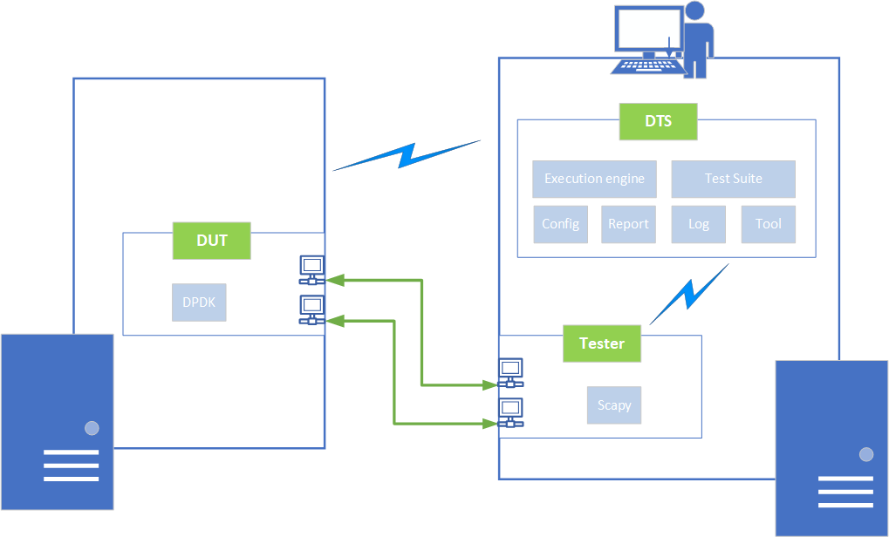

Introduction
============

This document describes how to install and configure the Data Plane Development Kit Test Suite (DTS) in a Linux environment.
DTS is an automation test tool for DPDK, wrote in `Python3`.
DTS includes one set of test cases and DPDK generic test framework.
DTS provides test example, references and framework for open source community.
Based on DTS, everyone can develop their test plan, automation script and configuration for own features and platform.
In addition, DTS provides a solution to allow that DPDK developers contribute their function test to certify their patch integration.
It only requires limited effort to maintain test cases once merged into DPDK Test Suite.
Everyone can utilize DTS to measure performance and functionality for features.

As a generic test framework, DTS provides the following functions:

* Communicate/manage DUT and Tester by SSH connection.
* Able to work with DUT (Device Under Test), which installed Fedora, Ubuntu, CentOS, RHEL, etc.
* Support virtualization hypervisor Qemu.
* Support both software and hardware traffic generators, including Scapy, TRex and IXIA®.
* Provide configure files to customize test suite and test cases to run under DUT.
* Provide debug and log functionalities for tracking test cases execution process.
* Support to output test result by excel, json, log text file, etc.

DTS environment includes DUT (Device under Test), Tester and Traffic generator. DPDK are deployed on DUT and DTS can run on the Tester or DUT or the third machine.

.. note::

   * If run with functional testing, DTS uses `Scapy` as traffic generator, recommend installing DTS on Tester.
   * If run with performance testing, DTS can use `TRex` or IXIA as traffic gengerator based on your deployment and configuration, recommend installing DTS on DUT.
     * If use `TRex`, recommend deploying `TRex` and DUT on the same machine with different sockets.

Please see a functional deployment example in the following figure:

This architecture provides automatically mechanism to manage tester, DUT and packet generators, and remove dependency between test script and test environment/hardware.
It defines one abstraction layer for DPDK Test Suite, and provides extensibility to add more test script.
In the DPDK Test Suite Test Framework, it provides the following modules to help to manage device, platform, configure and test results.

.. table::

    +---------------------+------------------------------------------------------------------------------+
    | File Name/Directory | Description                                                                  |
    +=====================+==============================================================================+
    | dts                 | Main Application for DTS                                                     |
    +---------------------+------------------------------------------------------------------------------+
    | framework           | Folder with dts framework modules                                            |
    +---------------------+------------------------------------------------------------------------------+
    | nics                | Folder with different network device modules                                 |
    +---------------------+------------------------------------------------------------------------------+
    | conf                | Folder with different config files                                           |
    +---------------------+------------------------------------------------------------------------------+
    | execution.cfg       | Default execution file                                                       |
    +---------------------+------------------------------------------------------------------------------+
    | executions          | Folder with several execution file samples                                   |
    +---------------------+------------------------------------------------------------------------------+
    | output              | Folder which contain running log files and result files                      |
    +---------------------+------------------------------------------------------------------------------+
    | dep                 | Folder with dependence scripts                                               |
    +---------------------+------------------------------------------------------------------------------+
    | test_plans          | Folder with rst files which contain the description of test suites and cases |
    +---------------------+------------------------------------------------------------------------------+
    | tests               | Folder with test scripts for test suites and cases                           |
    +---------------------+------------------------------------------------------------------------------+
    | doc                 | Folder with DTS related documents                                            |
    +---------------------+------------------------------------------------------------------------------+
    | requirements.txt    | DTS required Python packages                                                 |
    +---------------------+------------------------------------------------------------------------------+

These test script provides example and reference. Everyone can develop their test cases, verify their features functionality, and commit generic test report to maintainer.
, user-defined test cases, test plans and scripts must follow DPDK Test Suite standard including code standard, naming conventions, configure format, rst test plan, API.

Please see test cases, which are included in the DPDK compliance test suites:

.. table::

    +---------------------+----------------------------------------------------------------------------------------------------------------------------+
    | Test Suite          | Descriptions                                                                                                               |
    +=====================+============================================================================================================================+
    | hello_world         | Print a ``helloworld`` message on every enabled logic core.                                                                |
    +---------------------+----------------------------------------------------------------------------------------------------------------------------+
    | Timer               | Shows how timer can be used in a RTE application.                                                                          |
    +---------------------+----------------------------------------------------------------------------------------------------------------------------+
    | checksum_offload    | Tests RX/TX L3/L4 Checksum offload features by Poll Mode Drivers                                                           |
    +---------------------+----------------------------------------------------------------------------------------------------------------------------+
    | jumbo_frame         | Tests jumbo frames features by Poll Mode Drivers                                                                           |
    +---------------------+----------------------------------------------------------------------------------------------------------------------------+
    | testpmd             | Provides benchmark tests for the Intel Ethernet Controller (82599) Poll Mode Driver.                                       |
    +---------------------+----------------------------------------------------------------------------------------------------------------------------+
    | L3fwd               | Verifies Layer-3 Forwarding results using ``l3fwd`` application.                                                           |
    +---------------------+----------------------------------------------------------------------------------------------------------------------------+
