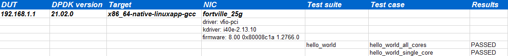

Test Result
===========

Overview
--------

After DTS finished the validation, we can find the result files similar as below in output folder.

.. code-block:: console

   rst_report  dts.log  statistics.txt  TestHelloWorld.log  test_results.json  test_results.xls

*   rst_report: contains the result RST file of performance data
*   dts.log: Full execution log of DTS framework
*   statstics.txt: summary statistics of DTS executed suites
*   TestHelloWorld.log: log message of Test suite: HelloWorld
*   test_result.json: json format result file
*   test_result.xls: excel format result file

Statistics
----------

You can go through the summary of execution result via statistic.txt. This file includes the number of passed test cases, the number of failed case, the number of blocked and pass ratio.

Please see example as the following. You can cat the sample file, then show this information of execution, totally executed two test cases, all cases passed the criterion and no failed or blocked cases.

.. code-block:: console

   [root@tester output]# cat statistics.txt
   dpdk_version = 21.02.0
   Passed     = 2
   Failed     = 0
   Blocked    = 0
   Pass rate  = 100.0

Details
-------

DTS provides 2 formats for test results, one is json, and the other is excel.
If you need more detail information of test result, either of them is good to check.
Both of them contain case names and results, also the failure reasons.

* JSON result: result.json

.. code-block:: console

    {
        "192.168.1.1": {
            "dpdk_version": "21.02.0",
            "nic": {
                "driver": "vfio-pci",
                "firmware": "8.00 0x80008c1a 1.2766.0",
                "kdriver": "i40e-2.13.10",
                "name": "fortville_25g"
            },
            "x86_64-native-linuxapp-gcc": {
                "hello_world/test_hello_world_all_core": "passed"
                "hello_world/test_hello_world_single_core": "passed"
            }
        }
    }

* Excel result: test_result.xls

Logs
----

If you want to track more details about the process of each suite, please go to log file which named by this suite, all related information will stored in this file.

Please see example for TestHelloWorld suite log as the following. This log file showed that application helloworld sent hello message from core1, and finally matched the pass criterion.

.. code-block:: console

   31/12/2020 11:04:00                 INFO:
   TEST SUITE : TestHelloWorld
   31/12/2020 11:04:00                 INFO: NIC :       fortville_25g
   31/12/2020 11:04:00        SUITE_DUT_CMD: meson configure -Dexamples=helloworld x86_64-native-linuxapp-gcc
   31/12/2020 11:04:01        SUITE_DUT_CMD: ninja -C x86_64-native-linuxapp-gcc
   31/12/2020 11:04:07     SUITE_DUT_OUTPUT: ninja: Entering directory `x86_64-native-linuxapp-gcc'^M
     [0/1] Regenerating build files.^M
     The Meson build system^M
     Version: 0.55.3^M
     Source dir: /root/dpdk^M
     Build dir: /root/dpdk/x86_64-native-linuxapp-gcc^M
     Build type: native build^
     …
     Build targets in project: 998^M
     Found ninja-1.10.0.git.kitware.jobserver-1 at /usr/local/bin/ninja^M
     [1/2] Compiling C object examples/dpdk-helloworld.p/helloworld_main.c.o^M
     [2/2] Linking target examples/dpdk-helloworld
   31/12/2020 11:04:09                INFO: Test Case test_hello_world_single_core Begin
   31/12/2020 11:04:13       SUITE_DUT_CMD: ./x86_64-native-linuxapp-gcc/examples/dpdk-helloworld  -l 1 -n 4   --file-prefix=dpdk_10243_20201231110241
       SUITE_DUT_OUTPUT: EAL: Detected 72 lcore(s)^M
   …
   hello from core 1
   31/12/2020 11:04:15                 INFO: Test Case test_hello_world_single_core Result PASSED:
   31/12/2020 11:04:25                 INFO:
   TEST SUITE ENDED: TestHelloWorld
