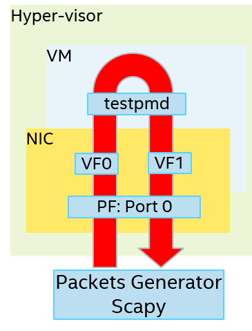

.. SPDX-License-Identifier: BSD-3-Clause
   Copyright(c) 2019 Intel Corporation

====================================
VF Request Queue Number At Runtime
====================================

Both kernel driver, I40E and DPDK PMD driver, igb_uio/vfio-pci support
VF request queue number at runtime, that means the users could configure
the VF queue number at runtime.

Snice DPDK 19.02, VF is able to request max to 16 queues and the PF EAL
parameter 'queue-num-per-vf' is redefined as the number of reserved queue
per VF. For example, if the PCI address of an i40e PF is aaaa:bb.cc,
with the EAL parameter -a aaaa:bb.cc,queue-num-per-vf=8, the number of
reserved queue per VF created from this PF is 8. The valid values of
queue-num-per-vf inclues 1,2,4,8,16, if the value of queue-num-per-vf
is invalid, it is set as 4 forcibly, if there is no queue-num-per-vf
setting in EAL parameters, it is 4 by default. If VF request more than
reserved queues per VF, PF will able to allocate max to 16 queues after
a VF reset. If VF request smaller than reserved queues per VF, PF will
able to allocate the request queues without a VF reset.

Note: there are 3 test plans about VF Request Queue Number At Runtime.
Please read all test plans to get complete information.

* runtime_vf_queue_number_test_plan.rst
* runtime_vf_queue_number_maxinum_test_plan.rst
* runtime_vf_queue_number_kernel_test_plan.rst

Prerequisites
=============

1. Hardware:

-  Intel® Ethernet 700 Series(X710/XXV710/XL710)

2. Software:

- DPDK: http://dpdk.org/git/dpdk (version: 19.02+)
- Scapy: http://www.secdev.org/projects/scapy/

3. Scenario:

- DPDK PF + DPDK VF

4. test topology:

Set up scenario
===============

Assume create 2 vf from 1pf.

1. Bind PF to DPDK driver, igb_uio::

     ./usertools/dpdk-devbind.py -b igb_uio 0000:18:00.0

2. Create 2 vf from PF::

     echo 2 >/sys/bus/pci/devices/0000:18:00.0/max_vfs

     usertools/dpdk-devbind.py --s
     0000:18:00.0 'Ethernet Controller X710 for 10GbE SFP+' if= drv=igb_uio unused=i40e
     0000:18:02.0 'XL710/X710 Virtual Function' unused=

3. Detach VF from the host, bind them to vfio-pci driver::

     modprobe vfio
     modprobe vfio-pci

   Note: there are 2 ways to bind devices to vfio-pci:

- Leverage usertools in dpdk package::

     usertools/dpdk-devbind.py --bind=vfio-pci 0000:18:02.0

- leverage Linux command::

     using `lspci -nn|grep -i ethernet` got VF device id, for example "8086 154c",

     echo "8086 154c" > /sys/bus/pci/drivers/vfio-pci/new_id
     echo 0000:18:02.0 > /sys/bus/pci/devices/0000:18:02.0/driver/unbind
     echo 0000:18:02.0 > /sys/bus/pci/drivers/vfio-pci/bind

4. Passthrough VFs 18:02.0 to vm0 and start vm0::

     /usr/bin/qemu-system-x86_64  -name vm0 -enable-kvm \
     -cpu host -smp 4 -m 2048 -drive file=/home/image/sriov-1.img -vnc :1 \
     -device vfio-pci,host=0000:18:02.0,id=pt_0

Now the scenario has been set up, you will have 1 port in the vm0.

5. Bind VF to dpdk driver igb_uio in VM::

    usertools/dpdk-devbind.py --bind=igb_uio 0000:03:00.0

Test case 1: reserve valid vf queue number
==========================================

1. Start PF testpmd with random queue-num-per-vf in [1, 2, 4, 8 ,16], for example, we use 4 as the reserved vf queue numbers::

     ./<build_target>/app/dpdk-testpmd -c f -n 4 -a 18:00.0,queue-num-per-vf=4 \
     --file-prefix=test1 --socket-mem 1024,1024 -- -i

   Note testpmd can be started normally without any wrong or error.

2. Start VF testpmd::

     ./<build_target>/app/dpdk-testpmd -c 0xf0 -n 4 -a 03:00.0 \
     --file-prefix=test2 --socket-mem 1024,1024 -- -i

3. VF request a queue number that is equal to reserved queue number, and we can not find VF reset while confiuring it::

     testpmd> port stop all
     testpmd> port config all txq 4
     testpmd> port config all rxq 4
     testpmd> port start all

   Start forwarding, you can see the actual queue number is 4, and there is no VF reset operation::

     testpmd> start
     port 0: RX queue number: 4 Tx queue number: 4

4. VF request a queue number that is greater than reserved queue number, and we find VF reset while confiuring it::

     testpmd> port stop all
     testpmd> port config all txq 5
     testpmd> port config all rxq 5
     testpmd> port start all

   Start forwarding, you can see the actual queue number is 5, and find VF reseted::

     testpmd> start
     port 0: RX queue number: 5 Tx queue number: 5

Note: Please find the expected behavior with different queue-num-per-vf in table[1].

[1] VF request queue number with expected VF reset operation::

    +------------------+---------------------+--------------------+
    | queue-num-per-vf | configured vf queue | VF reset operation |
    +==================+=====================+====================+
    | 1                | 1                   | NO                 |
    +------------------+---------------------+--------------------+
    | 1                | 2                   | YES                |
    +------------------+---------------------+--------------------+
    | 2                | 2                   | NO                 |
    +------------------+---------------------+--------------------+
    | 2                | 3                   | YES                |
    +------------------+---------------------+--------------------+
    | 4                | 4                   | NO                 |
    +------------------+---------------------+--------------------+
    | 4                | 5                   | YES                |
    +------------------+---------------------+--------------------+
    | 8                | 8                   | NO                 |
    +------------------+---------------------+--------------------+
    | 8                | 9                   | YES                |
    +------------------+---------------------+--------------------+
    | 16               | 16                  | NO                 |
    +------------------+---------------------+--------------------+

Test case 2: reserve invalid VF queue number
============================================

1. Start PF testpmd with random queue-num-per-vf in [0, 3, 5-7 , 9-15, 17], for example, we use 0 as the reserved vf queue numbers::

     ./<build_target>/app/dpdk-testpmd -c f -n 4 -a 18:00.0,queue-num-per-vf=0 \
     --file-prefix=test1 --socket-mem 1024,1024 -- -i

2. Verify testpmd started with logs as below::

     i40e_pf_parse_vf_queue_number_handler(): Wrong VF queue number = 0, it must be power of 2 and equal or less than 16 !, Now it is kept the value = 4

Test case 3: set valid VF queue number in testpmd command-line options
======================================================================

1. Start PF testpmd::

      ./<build_target>/app/dpdk-testpmd -c f -n 4 -a 18:00.0 \
      --file-prefix=test1 --socket-mem 1024,1024 -- -i

2. Start VF testpmd with "--rxq=[rxq] --txq=[txq]", and random valid values from 1 to 16, take 3 for example::

     ./<build_target>/app/dpdk-testpmd -c 0xf0 -n 4 -a 18:02.0 --file-prefix=test2 \
     --socket-mem 1024,1024 -- -i --rxq=3 --txq=3

3. Configure vf forwarding prerequisits and start forwarding::

     testpmd> set promisc all off
     testpmd> set fwd mac

4. Start forwarding, and verfiy the queue number informantion. both the RX queue number and the TX queue number must be same as your configuration. Here is 3::

     testpmd> start

     port 0: RX queue number: 3 Tx queue number: 3

5. Send packets to VF from tester, and make sure they match the default RSS rules, IPV4_UNKNOW, and will be distributed to all the queues that you configured, Here is 3::

     pkt1 = Ether(dst="$vf_mac", src="$tester_mac")/IP(src="10.0.0.1",dst="192.168.0.1")/("X"*48)
     pkt2 = Ether(dst="$vf_mac", src="$tester_mac")/IP(src="10.0.0.1",dst="192.168.0.2")/("X"*48)
     pkt3 = Ether(dst="$vf_mac", src="$tester_mac")/IP(src="10.0.0.1",dst="192.168.0.3")/("X"*48)

6. Stop forwarding, and check the queues statistics, every RX/TX queue must has 1 packet go through, and total 3 packets in uni-direction as well as 6 packets in bi-direction::

    testpmd> stop

      ------- Forward Stats for RX Port= 0/Queue= 0 -> TX Port= 0/Queue= 0 -------
      RX-packets: 1       TX-packets: 1       TX-dropped: 0
      ------- Forward Stats for RX Port= 0/Queue= 1 -> TX Port= 0/Queue= 1 -------
      RX-packets: 1              TX-packets: 1             TX-dropped: 0
      ------- Forward Stats for RX Port= 0/Queue= 2 -> TX Port= 0/Queue= 2 -------
      RX-packets: 1              TX-packets: 1             TX-dropped: 0
      ---------------------- Forward statistics for port 0  ----------------------
      RX-packets: 3      RX-dropped: 0     RX-total: 3
      TX-packets: 3       TX-dropped: 0             TX-total: 3
      ----------------------------------------------------------------------------

7. Repeat step 2 to 6 with the mininum queue number, 1, and the maximum queue number, 16.

Test case 4: set invalid VF queue number in testpmd command-line options
========================================================================

1. Start PF testpmd::

     ./<build_target>/app/dpdk-testpmd -c f -n 4 -a 18:00.0 \
     --file-prefix=test1 --socket-mem 1024,1024 -- -i

2. Start VF testpmd with "--rxq=0 --txq=0" ::

     ./<build_target>/app/dpdk-testpmd -c 0xf0 -n 4 -a 18:02.0 --file-prefix=test2 \
     --socket-mem 1024,1024 -- -i --rxq=0 --txq=0

   Verify testpmd exited with error as below::

    Either rx or tx queues should be non-zero

3. Start VF testpmd with "--rxq=17 --txq=17" ::

     ./<build_target>/app/dpdk-testpmd -c 0xf0 -n 4 -a 18:02.0 --file-prefix=test2 \
     --socket-mem 1024,1024 -- -i --rxq=17 --txq=17

   Verify testpmd exited with error as below::

     txq 17 invalid - must be >= 0 && <= 16

Test case 5: set valid VF queue number with testpmd function command
====================================================================

1. Start PF testpmd::

     ./<build_target>/app/dpdk-testpmd -c f -n 4 -a 18:00.0 \
     --file-prefix=test1 --socket-mem 1024,1024 -- -i

2. Start VF testpmd without setting "rxq" and "txq"::

     ./<build_target>/app/dpdk-testpmd -c 0xf0 -n 4 -a 05:02.0 --file-prefix=test2 \
     --socket-mem 1024,1024 -- -i

3. Configure vf forwarding prerequisits and start forwarding::

     testpmd> set promisc all off
     testpmd> set fwd mac

4. Set rx queue number and tx queue number with random value range from 1 to 16 with testpmd function command, take 3 for example::

     testpmd> port stop all
     testpmd> port config all rxq 3
     testpmd> port config all txq 3
     testpmd> port start all

5. Repeat step 4-7 of test case 3.

Test case 6: set invalid VF queue number with testpmd function command
======================================================================

1. Start PF testpmd::

     ./<build_target>/app/dpdk-testpmd -c f -n 4 -a 18:00.0 \
     --file-prefix=test1 --socket-mem 1024,1024 -- -i

2. Start VF testpmd without setting "rxq" and "txq"::

     ./<build_target>/app/dpdk-testpmd -c 0xf0 -n 4 -a 05:02.0 --file-prefix=test2 \
     --socket-mem 1024,1024 -- -i

3. Set rx queue number and tx queue number with 0 ::

     testpmd> port stop all
     testpmd> port config all rxq 0
     testpmd> port config all txq 0
     testpmd> port start all

4. Set rx queue number and tx queue number with 17 ::

     testpmd> port stop all
     testpmd> port config all rxq 17
     testpmd> port config all txq 17
     testpmd> port start all

Verify error information::

     Fail: input rxq (17) can't be greater than max_rx_queues (16) of port 0

Test case 7: Reserve VF queue number when VF bind to kernel driver
==================================================================

1. bind vf to kernel driver iavf::

     ./usertools/dpdk-devbind.py -b i40e 0000:18:02.0

2. Reserve VF queue number ::

     ./<build_target>/app/dpdk-testpmd -c f -n 4 -a 18:00.0,queue-num-per-vf=2 \
     --file-prefix=test1 --socket-mem 1024,1024 -- -i

3. Check the VF0 rxq and txq number is 2::

     ethtool -S enp5s2
     NIC statistics:
          rx_bytes: 0
          rx_unicast: 0
          rx_multicast: 0
          rx_broadcast: 0
          rx_discards: 0
          rx_unknown_protocol: 0
          tx_bytes: 0
          tx_unicast: 0
          tx_multicast: 0
          tx_broadcast: 0
          tx_discards: 0
          tx_errors: 0
          tx-0.packets: 0
          tx-0.bytes: 0
          tx-1.packets: 0
          tx-1.bytes: 0
          rx-0.packets: 0
          rx-0.bytes: 0
          rx-1.packets: 0
